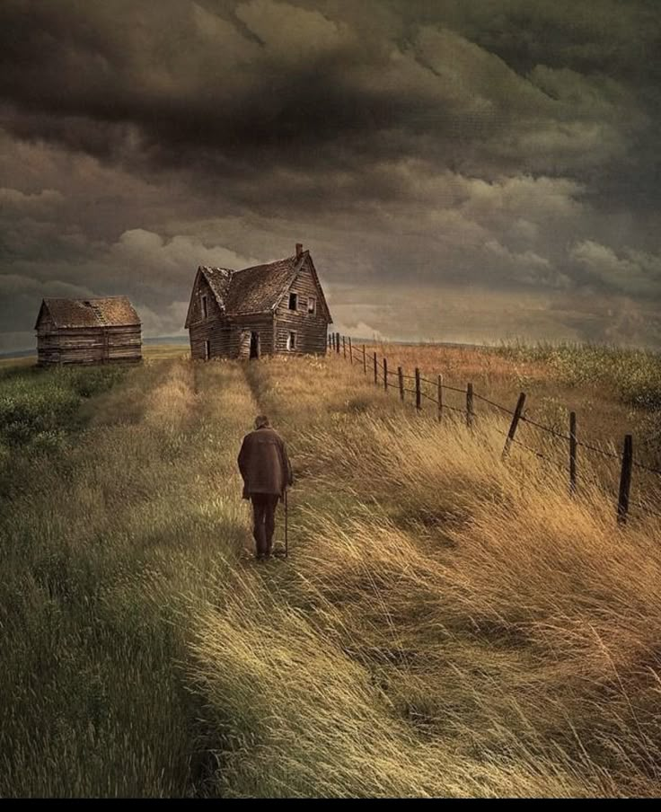
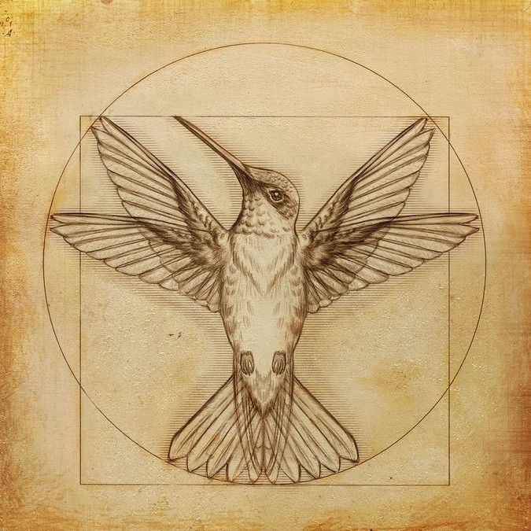
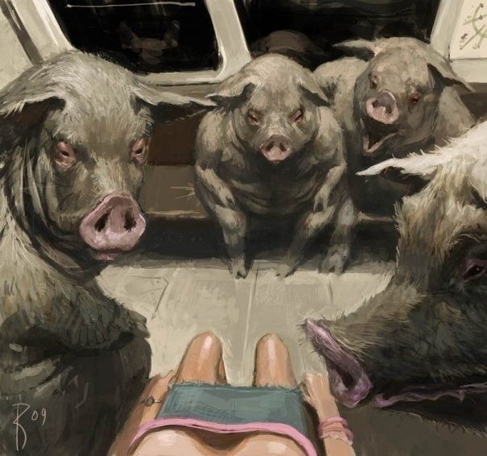

## This are only some thoughts or ideas that at this time of my life I've been frequently thinking of

**12/03/2025**

- Return to a simpler life. We can only be free if we lower our life standards. We must understand once and for all that freedom
belongs to us since we are born. We lose our freedom as we grow up in this poisoned system, which forces you into this money race. Freedom is priceless.

- Be minimalistic, get rid of everything you don't need. You don't need more than two jackets or more than two or three trousers. Keep your
wardrobes simple. The same goes for the furniture in your home. In other words, keep your belongings as few as possible.

- This will allow you to think more about your goals and not about material things. We are not our possessions, we are not our bank accounts, we
are none of that but our thoughts.

- Be ready to leave it all, be ready for an unexpected journey, be ready to pack your few things and run away, to escape at any moment.

**10/03/2025**

- Art is the most important concept, and it's our responsibility to search for and study art.
I will give you a definition of art, my own definition. Again, it's up to you to modify it or take it as true.
Art is creation, art is crafting something. It might be an object, a script, a painting, or any artifact. It might also be something
abstract like a piece of software, but it will be art only and only if it is combined with or comes along with an intention, a purpose,
some kind of hidden message, or expression of emotions or feelings from its creator, the artist.

- I understood why I was trying to live in a world of pure imagination. Romanticizing the world in which we live in is mandatory.
It's required to get the most from it, not only a silly idea of romanticism but the most powerful ability that we possess as humans.
Being able to detect these hidden mysteries, those hidden universes out there, in the little, ordinary, and simple things will take us
to the next level of completeness. (El misterio esta aquende no allende)

**09/03/2025**

- Don't take yourself too seriously; life is a joke, a comedy. Drama is for maggots.

- Awkwardness is my signature.

- The darkness is coming, yeah! Yonkis and crazy bastards all over the city, they are not invisible anymore, and you know what?
It is contagious, so do not spit into the wind.

- The darkness is coming because the light has failed. Those who claim to be part of the light are only big fucking walls, which only cast more shadows upon us.

- The people have no more identity; everyone out there now shares the same political ideology, listens to the same type of music, visits the same touristy places,
enjoys going to the same restaurants and sharing it on social media, and wears the same clothes, only with some subtle differences. 
But the essence is the same. We live in an ocean full of clones, clowns, jokers who clap at the same very moment over and over, idiots who were brainwashed.

- Can barely distinguish good from evil. The taste of every side has been so confusing lately; I'm afraid I was already corrupted after living for so long in this horrible place.

- Seeking truly strong connections is the new trend, but still, I think I'm doing the same. So I can't be too critical of this because I might be hypocritical.

